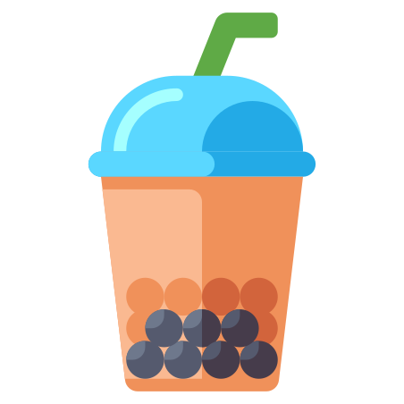
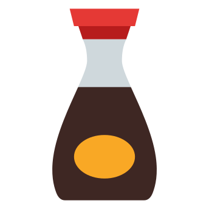

---
hide:
  - footer
---

# about

  

## {  width="25" }bio

Stephanie Isan (she/they) is the pen name of a queer Taiwanese American writer and software engineer from the San Francisco bay area. 

Her stories and poems are published and/or forthcoming in: *The Bellevue Literary Review*, *Joyland*, *Epiphany*, *jmww*, and *Frontier Poetry*. She was a finalist for the *Palette Poetry 2021 Prize* and longlisted for the *2021 Frontier OPEN*. 

Stephanie is an alum of the [Tin House Workshop](https://tinhouse.com/workshop/) and a [Kundiman](http://www.kundiman.org/fellows) fiction fellow. She is currently a fiction reader for [Fractured Literary](https://fracturedlit.com/) and an Assistant Poetry Editor at [Barrelhouse Mag](https://www.barrelhousemag.com/). 

In her free time, she likes to, in no particular order: take long walks on air-conditioned treadmills at sunset, eat brunch with fancy mimosas, play video games, pet cats, dogspot, and drink sriracha straight from the bottle.

She currently lives with two cats, one beagle mix, and her husband <s>in an Asian pear tree</s> in the southwestern US. 

## {  width="20" }credits

#### photo
&nbsp; Credit demanded by: husbando  :fontawesome-solid-heart:{ .heart }

#### site 
&nbsp; Made with: [Material for mkdocs](https://squidfunk.github.io/mkdocs-material/)

#### icons 
&nbsp; Yoinked from <a target="_blank" href="https://icons8.com">Icons8</a>

