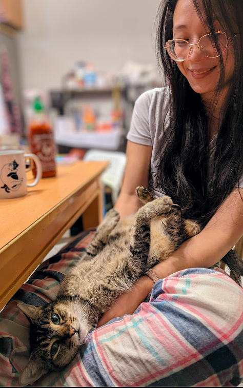

---
hide:
  - footer
---

# about

 
 
## {  width="40" }bio

Stephanie Isan (she/they) is a queer Taiwanese American writer and software engineer from the San Francisco bay area. 

Her stories and poems are published and/or forthcoming in: *jmww* and *Frontier Poetry*. She was a finalist for the *Palette Poetry 2021 Prize* and longlisted for the *2021 Frontier OPEN*. 

She is a fiction reader for [Fractured Literary](https://fracturedlit.com/) and an Assistant Poetry Editor at [Barrelhouse Mag](https://www.barrelhousemag.com/). 

In her free time, she likes to, in no particular order: take long walks on air-conditioned treadmills at sunset, eat brunch with fancy mimosas, play video games, pet cats, dogspot, and drink sriracha straight from the bottle.

She currently lives with sixteen crane machine plushies, two grumpy grey tabbies, one howling beagle mix, and her partner <s>in an Asian pear tree</s> in the southwestern US.

## {  width="40" }testimonials 

- "...Violent Asian American Power Couple" ~ Slightly unwashed, possibly deranged, definitely terrifying man harassing her, her partner, and the baristas (suburban coffee shop, 2022)

- "Nice & smart girl. 漂亮, because I gave birth to her." ~ Her mother (somewhere in Tainan City on a video call, 2021)

- "...has a big zit on her cheek. Also needs to stop biting her nails." ~ Older sibling (dim sum parking lot, 2012)

- "Lots of Pusheen plushies on her desk. Can probably drink twice her weight in La Croix." ~ Friendly co-worker (by the watercooler, 2017)

- "aWOOOooOoOoOOooo" ~ Her dog (dog park, every time)

## {  width="40" }credits

#### photos
&nbsp; Credit demanded by: partner  :fontawesome-solid-heart:{ .heart }

#### site 
&nbsp; Site made with: [Material for mkdocs](https://squidfunk.github.io/mkdocs-material/)

#### icons 
&nbsp; Yoinked from <a target="_blank" href="https://icons8.com">Icons8</a>:

<ul style="list-style-type: none; line-height: 1em! important;">
  <li><a target="_blank" href="https://icons8.com/icon/COT3n5g0HNI9/soy-sauce">Soy Sauce</a> icon</li>
  <li> <a target="_blank" href="https://icons8.com/icon/b3SmnBWFR09w/boba">Boba</a> icon</li>
  <li> <a target="_blank" href="https://icons8.com/icon/At5OBthGDHYJ/hot-sauce">Hot Sauce</a> icon </li>
  <li> <a target="_blank" href="https://icons8.com/icon/37880/sunny-side-up-eggs">Sunny Side Up Eggs</a> icon </li>
  <li> <a target="_blank" href="https://icons8.com/icon/np5aaglr7Ddq/raccoon">Raccoon</a> icon </li>
  <li> <a target="_blank" href="https://icons8.com/icon/SOMUZkJinLzw/desk">Cactus on a Desk</a> icon</a></li>
</ul>