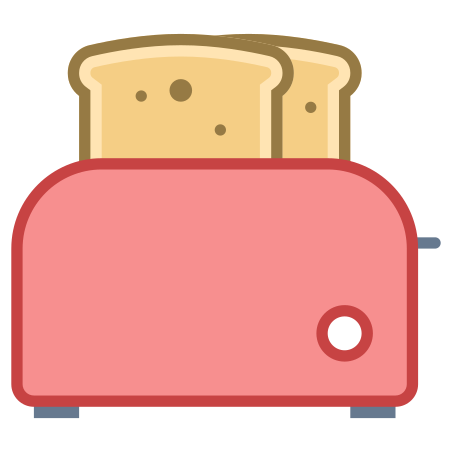

---
hide:
  - footer
---

# Publications & Honors 

## {  width="20" }Publications

### Fiction  
- "How to Make Non-Korean Kimchi" in [Split Lip](https://splitlipthemag.com/fiction/1125/stephanie-isan) (Nov 2025)
- "The Real Chupa Chup" in [Five Points](https://fivepoints.gsu.edu/issue/five-points-vol-24-no-1/) (May 2025)
- "Hey, Cam Club" in [Joyland Magazine](https://joylandmagazine.com/fiction/hey-cam-club/) (May 2024)
- "The Last Thing She Touched" in [The Bellevue Literary Review](https://blreview.org/table-of-contents/issue-45/) (Oct 2023)

### Flash Fiction 
- "Chinese Mermaids" in [jmww](https://jmwwblog.wordpress.com/2022/11/23/flash-fiction-chinese-mermaids-by-stephanie-isan/) (Nov 2022)

### Poetry
- "Unsung" in [Epiphany](https://epiphanyzine.com/features/2023/8/8/unsung-by-stephanie-isan) (Aug 2023)
- "Spring Rituals" in [Frontier Poetry](https://www.frontierpoetry.com/2022/03/04/poetry-stephanie-isan/) (March 2022) 

---

## {  width="20" }Honors

### Fellowships & Workshops
- [Kundiman](http://www.kundiman.org/), Fiction 
- [Tin House Summer Workshop 2024](https://tinhouse.com/workshop/summer-workshop-2/), Fiction *(with Emme Lund)*
- [Tin House Winter Workshop 2024](https://tinhouse.com/workshop/winter-workshop/), Fiction *(with Jenny Zhang)*
- Finalist, [Periplus](https://twitter.com/PeriplusCollect), Fiction 

### Fiction 
- *Longlisted*, [Wigleaf, Top 50](https://wigleaf.com/2023longlist.htm), for "Chinese Mermaids"

### Poetry
- *Finalist*, [Palette Poetry 2021 Prize](https://www.palettepoetry.com/2021/11/09/winners-and-finalists-for-the-2021-palette-poetry-prize/), for "Spring Rituals"  
- *Longlisted*, [Frontier Award for New Poets 2021](https://www.frontierpoetry.com/2021/12/13/2021-anp-winners-finalists/), for "Spring Rituals" 

---

## {  width="20" }Press

- [The Bellevue Literary Review](https://blreview.org/recent-news/blr-fall-2023-theartoftakingcare/), *The Art of Taking Care -- an Evening with Writers and Caregivers* (oct 2023)

