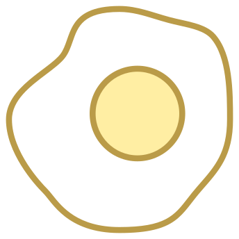

---
hide:
  - footer
---

# publications & honors 

## {  width="20" }publications

### fiction  
- "The Last Thing She Touched" in The Bellevue Literary Review (TBD, Fall 2023)

### flash fiction 
- "Chinese Mermaids" in [jmww](https://jmwwblog.wordpress.com/2022/11/23/flash-fiction-chinese-mermaids-by-stephanie-isan/) (Nov 2022)

### poetry
- "Unsung" in [Epiphany](https://epiphanyzine.com/features/2023/8/8/unsung-by-stephanie-isan) (Aug 2023)
- "Spring Rituals" in [Frontier Poetry](https://www.frontierpoetry.com/2022/03/04/poetry-stephanie-isan/) (March 2022) 

---

## {  width="20" }honors

### fellowships
- **[Kundiman](http://www.kundiman.org/)**, Fiction 
- **Finalist, [Periplus](https://twitter.com/PeriplusCollect)**, Fiction 

### fiction 
- **Longlisted, The Masters Review Winter Short Story Award**, for "The Last Thing She Touched"
- **Longlisted, [Wigleaf, Top 50](https://wigleaf.com/2023longlist.htm)**, for "Chinese Mermaids"

### flash fiction 
- **Longlisted, The Masters Review Flash Fiction Contest**, for "Chinese Mermaids"

### poetry
- **Finalist, Palette Poetry 2021 Prize**, for "Spring Rituals"  
- **Longlisted, Frontier OPEN 2021**, for "Spring Rituals" 

